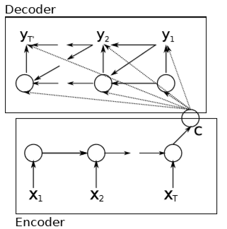
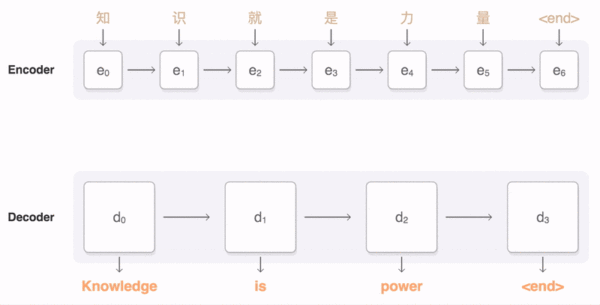
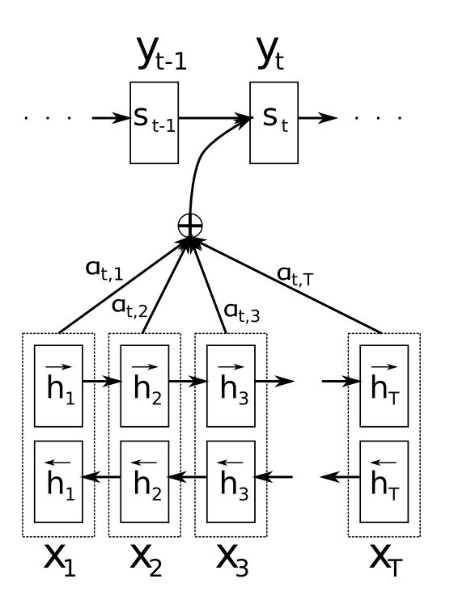
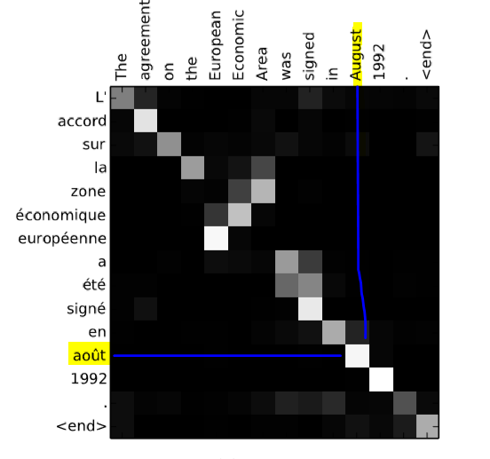

## 如何理解attention

通常的机器翻译 encoder-decoder 方法需要将输入的句子压缩至特定长度，这样的话机器处理长句子时会比较困难，所以引入attention机制来对长距离词汇进行特殊“关照”，要更好的理解attention这篇论文，就要从sequece to sequece这篇论文讲起

### **Sequence to sequence 机器翻译**

Learning Phrase Representations using RNN Encoder–Decoder  for Statistical Machine Translation 论文中使用两个RNN分别作为encoder和decoder。

所谓encoder，即将输入句子‘我是小明’，输入至rnn中，将每一步的隐层输出求和，记为c, c即为编好的‘码’，附论文原文：

> *The encoder is an RNN that reads each symbol of an input sequence **x** sequentially. As it reads each symbol, the hidden state of the RNN changes according to Eq.(1). After reading the end of the sequence(marked by an end-of-sequence symbol), the hidden state of the RNN is a summary **c** of the whole inputs equence.*  

decoder部分，通过上次隐层输出、本次输入以及码c，共同求解本次输出“i am xiaoming”。

> The decoder of the proposed model is another RNN which is trained to generate the output sequence by predicting the next symbol yt given the hidden state hhti. However, unlike the RNN described in Sec.2.1, both yt and hhti are also conditioned on yt−1 and on the summary c of the input sequence. Hence, the hidden state of the decoder at time t is computed by,
> $$
> h_{<t>}=f(h_{<t-1>},y_{<t-1>},c)
> $$
>

### attention机制

如开头所说，rnn存在长程梯度消失问题，对于较长的句子，我们很难将输入的序列转化为定长的向量而又保存所有的有效信息，所以随着句子长度增加，模型效果下降。

为解决这一问题，attention机制被引入了，attention机制和人类思考方式类似，即将注意力关注于我们正在翻译的上下文，同样的，attention模型中，我们翻译当前词语时，会寻找该词语源语句中对应的几个词语，并结合之前的已翻译部分作出翻译。

****

注意图中临近的单词在输入到decoder时有较深的颜色，远处的单词颜色淡，这也是attention机制中的最主要的一点，attention。

attention机制在原有encoder-decoder基础上进行了改进，与传统encoder-decoder不同的是**c 的计算方式**。传统方法，c是固定的，即所有隐层输出的和，但是在attetion机制中，c根据decoder不同输入而变化。

- 对于每个encoder隐层输出，记为$h_t$

- 当前decoder的隐层输出是 $s_{t-1}$

- 对于每一个输入位置j，计算与当前输出位置的关联性$e_{tj} =\alpha(s_{t-1},h_j)$,则 $\overrightarrow{e_t}$为所有相似度。

- $\alpha$是相似度计算方式，常见的如点乘，余弦

- 对$\overrightarrow{e_t}$进行softmax得到normalize的attention分布$\overrightarrow{\alpha_t} = softmax(\overrightarrow{e_t})$展开形式为$\alpha_{tj}=\frac{e_{tj}}{\sum_{k=1}^{T}{e_{tk}}}$

- 则可求到不同输入下的不同c值，$\overrightarrow{c_t}=\sum_{j=1}^{T}{\alpha_{tj}h_j}$

- 由此可计算下一个隐层输出，与传统方法一样$s_t=f(s_{t-1},y_{t-1},c_t)$

附论文attetion 权值矩阵实验结果

法语不太懂，但是可看出加入了attetion之后，机器已经知道了哪部分翻译对应哪部分原文字，图中august和aout即分别为英语法语的八月。

